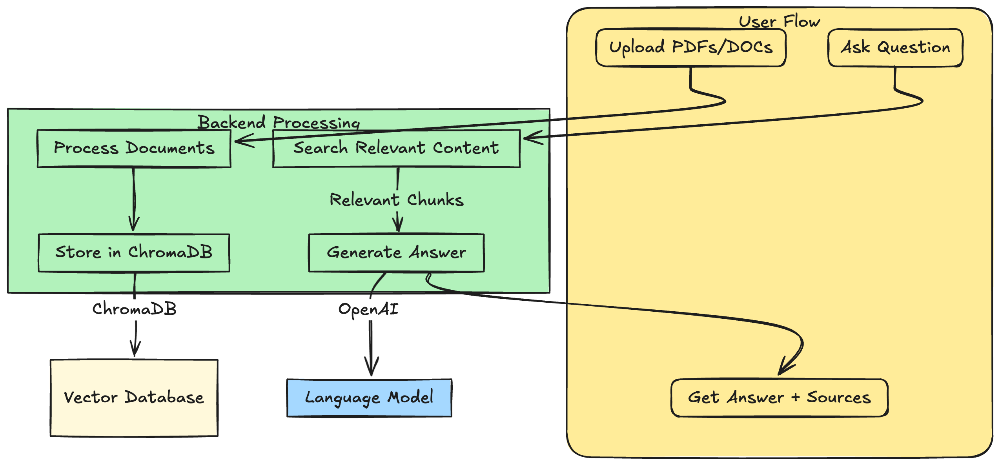
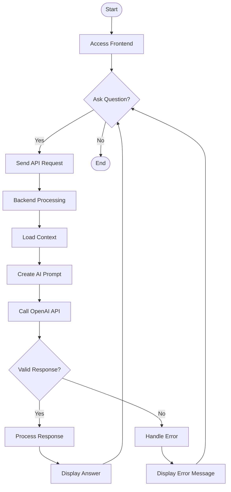

# Course Handout Assistant - BITS Pilani Dubai

An AI-powered chatbot that helps students find information from their course handouts quickly and efficiently.

**Developed by Neha, Rohil, Faaizah and Husam as part of the MTCxACMW HacktheBot Hackathon 2025**




## Currently Available Handouts
- CS F415 - Data Mining (First Semester 2023-2024)

## Features
- **Instant Answers**: Get quick responses to questions about course content
- **Context-Aware**: All answers are derived directly from official course handouts
- **User-Friendly Interface**: Simple chat interface for asking questions
- **Accurate Information**: Uses RAG (Retrieval-Augmented Generation) to ensure accuracy

# What are we building?

We will build a system with two primary features:

### 1. Chatbot for RAG-based Querying
- **Purpose:** Allow users to ask questions about course content using a Retrieval-Augmented Generation (RAG) system that comprises all course handouts.
- **Example Query:** "Which course teaches the concepts of building RAG?"
- **Functionality:** The chatbot will search through all course handouts and return the relevant results based on the user's query.

# Project Architecture

## Tech Stack

### Frontend
- HTML5
- CSS3
- JavaScript

### Backend
- Python 3.8+
- FastAPI
- LangChain
- OpenAI GPT-4

## Getting Started

### Prerequisites
- Python 3.8 or higher
- Node.js and npm (for development)
- OpenAI API key
- Tavily API key

### Installation

1. Clone the repository:
```bash
git clone https://github.com/yourusername/educareer-ai.git
cd educareer-ai
```

2. Set up the backend:
```bash
cd backend
python -m venv venv
source venv/bin/activate  # On Windows: venv\Scripts\activate
pip install -r requirements.txt
```

3. Configure environment variables:
```bash
cp .env.example .env
# Edit .env with your API keys and configuration
```

4. Start the backend server:
```bash
uvicorn main:app --reload
```

5. Open the frontend:
```bash
cd ../frontend
# Simply open index.html in your browser
```

## Usage

1. Open the application in your web browser
2. Select your preferred assistance mode
3. Start chatting with the AI
4. Use the various features like file upload, voice input, or screenshots as needed

## Project Structure

```
educareer-ai/
├── frontend/
│   ├── assets/
│   │   ├── css/
│   │   ├── js/
│   │   └── images/
│   ├── index.html
│   └── chat.html
├── backend/
│   ├── main.py
│   ├── requirements.txt
│   └── .env
└── README.md
```

## API Endpoints

- `POST /api/chat`: Main chat endpoint
- `GET /health`: Health check endpoint

## Contributing

1. Fork the repository
2. Create your feature branch (`git checkout -b feature/AmazingFeature`)
3. Commit your changes (`git commit -m 'Add some AmazingFeature'`)
4. Push to the branch (`git push origin feature/AmazingFeature`)
5. Open a Pull Request

## License

This project is licensed under the MIT License - see the LICENSE file for details.
